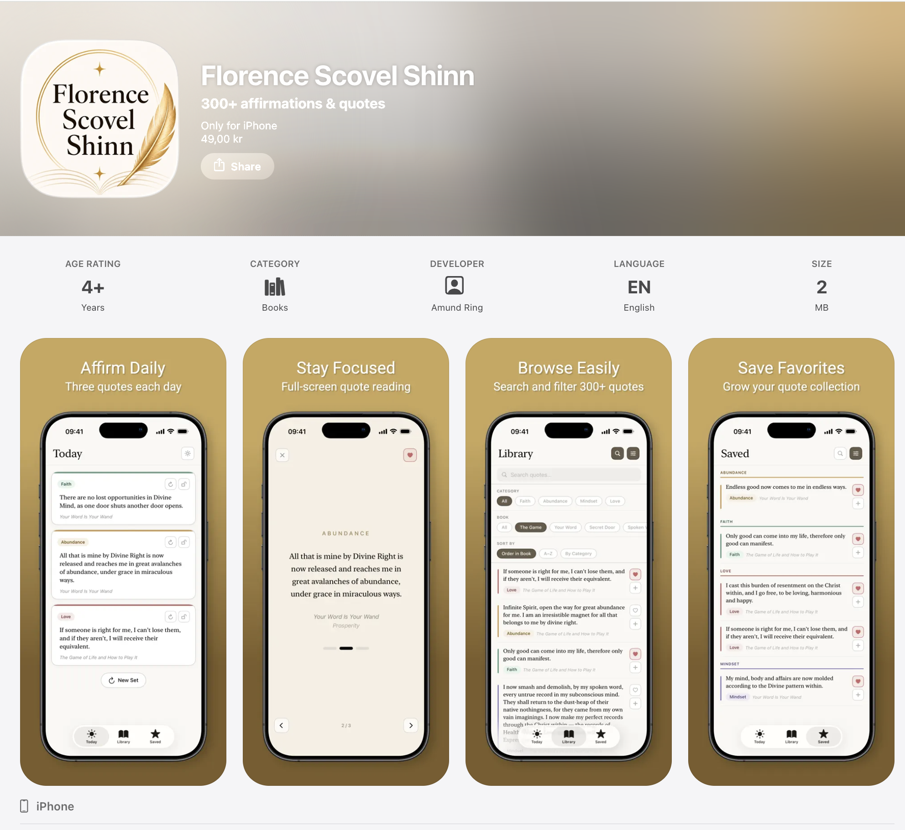

# Florence Scovel Shinn — Daily Affirmations

A native iOS app for working with the writings of Florence Scovel Shinn:
three quotes a day, a searchable library of 300+ passages from her four
published books, and a saved collection users build over time.

**Live on the App Store:**
[apps.apple.com/no/app/florence-scovel-shinn](https://apps.apple.com/no/app/florence-scovel-shinn/id6770525571)

Built solo in SwiftUI with SwiftData. Ported from a PWA I built first
([source](https://github.com/Amund-Ring/Florence-Scovel-Shinn)) once it was
clear the product deserved a native experience.



---

## Why this project exists

I wanted a focused way to work with Florence Scovel Shinn's affirmations
day-to-day. Her four books are dense and choosing which few lines to sit with
each day is the hard part. I built a PWA first to test the idea, used it for
several months, then rebuilt it natively in Swift to get the things the web
couldn't give me: a real status bar, proper dark mode, smooth swipe gestures
in focus mode, and a more durable home for user data.

This is my fourth shipped App Store app and my first fully native one. The
three earlier apps (ACIM Workbook, Meditations by Marcus Aurelius, Letters
from a Stoic) were built in React Native and continue to generate revenue —
ACIM Workbook in particular has shown steady MRR growth on a RevenueCat
subscription model.

## What it does

| Screen | Behavior |
|---|---|
| **Today** | Three quote slots, each individually lockable and refreshable. A weighted picker biases toward quotes the user has seen less recently, so the rotation feels fresh without being random. |
| **Library** | The full corpus, filterable by category (Faith / Abundance / Mindset / Love) and book, sortable by order-in-book, A–Z, or grouped by category. Live search across quote text. |
| **Saved** | Favorites with the same filters; defaults to sorting by date added. |
| **Focus mode** | Full-screen, swipeable quote viewer with looping. Accessible from Today and Saved. Quote text is selectable everywhere except Focus, where it would interfere with the swipe gesture. |
| **Themes** | Ivory and night themes with native dark-mode integration. |

## Architecture

A few decisions worth calling out:

**Content vs. user state are kept separate.**
`quotes.json` is the source of truth for quote content and ships as a bundle
resource. User-generated data (`isFavorite`, `timesShown`, `lastShown`) lives
in SwiftData, keyed to stable quote IDs. This means I can edit, add, or
re-categorize quotes in future releases without touching user data — and
without a migration.

**SwiftData for per-quote state, `@AppStorage` for simple preferences.**
The Today slot configuration, dark-mode toggle, and filter/sort selections
are small, flat, and read on every screen — `@AppStorage` is the right fit.
SwiftData is reserved for the per-quote rows where querying and relations
matter.

**Weighted random picker.**
Quotes carry a `lastShown` timestamp and a `timesShown` counter. The Today
picker weights inversely to recency, so a user who's been in the app for
months doesn't see the same five quotes on a loop. This logic was ported
from the PWA's `utils.js` and was one of the cleaner translations from
JavaScript to Swift.

**SwiftUI-first, no UIKit.**
The whole UI is SwiftUI. I considered UIKit for the swipe gesture in focus
mode but stayed in SwiftUI using `DragGesture` and a custom paging
implementation. Worth it for code uniformity.

## Stack

- **Language / UI:** Swift 5.10, SwiftUI
- **Persistence:** SwiftData (iOS 17+) for per-quote state; `@AppStorage`
  for preferences
- **Min iOS:** 17.6
- **Typography:** System serif + SF Pro — no bundled font assets
- **Build:** Xcode 15+, plain `xcodeproj` (no SPM dependencies; intentionally
  zero third-party libraries for an app of this scope)

## Project layout

```
FlorenceScovelShinn/
  Models/         Quote, QuoteUserState, Category
  Data/           QuoteStore — loads quotes.json, weighted picker
  Theme/          AppTheme, CategoryColors, Typography, PressableCardStyle
  Root/           RootView, tab navigation
  Today/          TodayScreen, TodayViewModel, TodayState, SlotPicker
  Library/        LibraryScreen, LibraryFilters, FilterControls, SearchBar
  Saved/          SavedScreen
  Focus/          FocusMode, FocusPresentation
  quotes.json     300+ quotes — single source of truth for content
```

Roughly 2,000 lines of Swift across 25 files.

## How it was built

I used Claude as a pair throughout — for architecture sketches, generating
boilerplate, debugging SwiftData edge cases, and reviewing diffs. I treat AI
the way I'd treat a strong but new collaborator: useful for velocity, but I
own every line that lands and every architectural call. This was the first
project where I felt the loop tighten enough that going from a working PWA
to a shipped native app fit alongside a full-time frontend role.

For context on the PWA-to-native port plan, see
[`ios-app-plan.md`](https://github.com/Amund-Ring/Florence-Scovel-Shinn/blob/main/ios-app-plan.md)
in the PWA repo.

## Build & run

1. Open `FlorenceScovelShinn.xcodeproj` in Xcode 15+
2. Select an iPhone 15 or newer simulator
3. ⌘R

No package dependencies, no signing setup beyond a personal team for local
runs.

## My published apps

- [Florence Scovel Shinn (this app)](https://apps.apple.com/no/app/florence-scovel-shinn/id6770525571) — native SwiftUI, paid
- [ACIM Workbook](https://apps.apple.com/no/app/acim-workbook/id6443900608) — React Native, subscription model
- [Meditations by Marcus Aurelius](https://apps.apple.com/no/app/meditations-by-marcus-aurelius/id6476632120) — React Native, paid
- [Letters from a Stoic](https://apps.apple.com/no/app/letters-from-a-stoic/id6736611477) — React Native, paid
